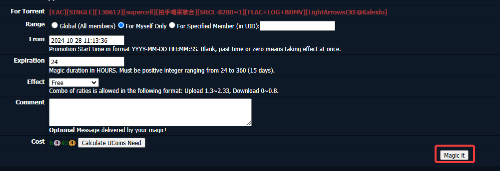

# u2 magic form

Chrome extension that automatically changes
the fields of the u2 magic form
to the following values:

- Range: "For Myself Only"
- Expiration: 24

And automatically clicks
the "Calculate UCoin Need" button.

## Installation

1. Clone the repository
2. Open Chrome and go to chrome://extensions/
3. Enable "Developer mode"
4. Click "Load unpacked" and select the cloned repository

## Usage

1. Go to a u2 release and click the "Magic" link:

    

2. The extension automatically fills in the form. Press "Magic it!"

    
